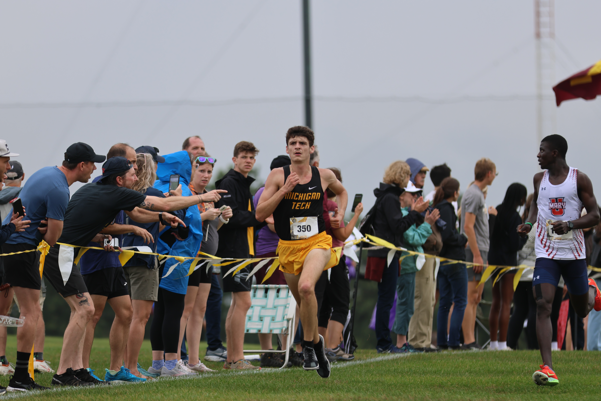

# About Me

## Hello!

I am **Michael Dennis**, a current Computer Science student at Michigan Tech.

I have experience in:

- Computer Vision
- Data Analytics
- Software Development
- Web Scraping
- Machine Learning

## Outside of Technology

I have a strong passion for both running and my community.

I competed in cross country and track throughout all four years of college, which gave me lifelong friendships while also teaching me discipline, consistency, and teamwork.

I am also an active member of my church community and enjoy spending time with family, teammates, and friends.

## Interests & Projects

I enjoy building all types of projects, although Computer Vision and Data Analytics hold a special place in my interests.

I especially enjoy projects that solve real-world problems and turn data into meaningful insights.

